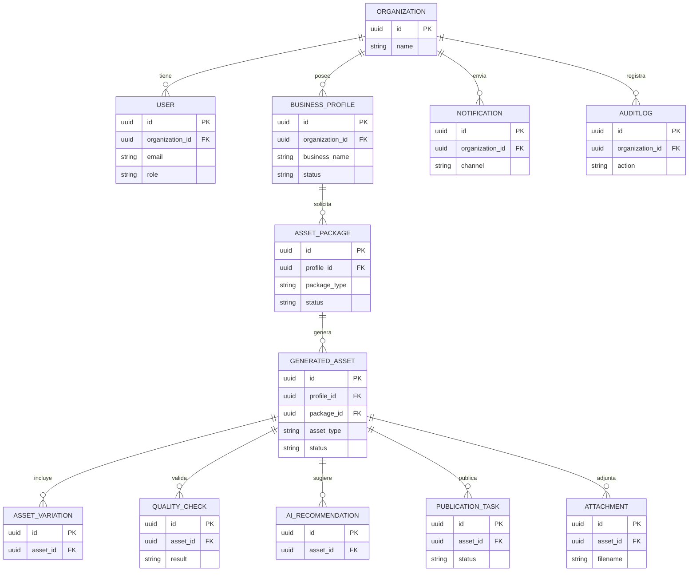
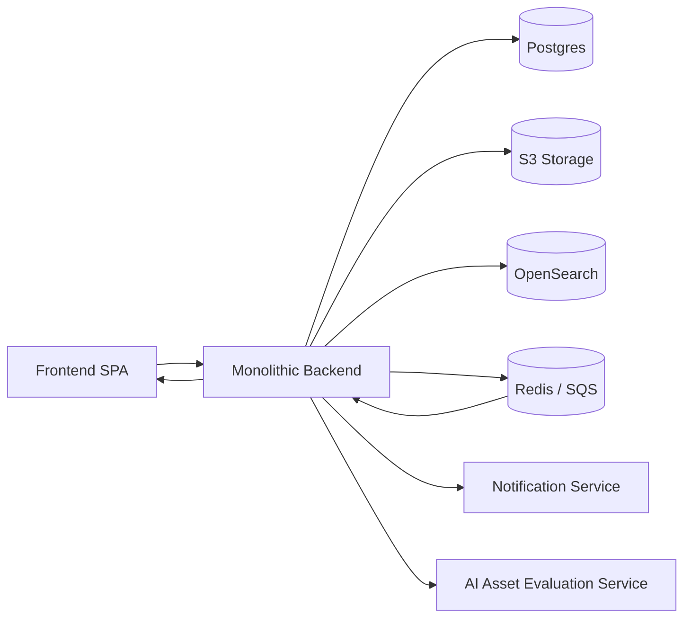
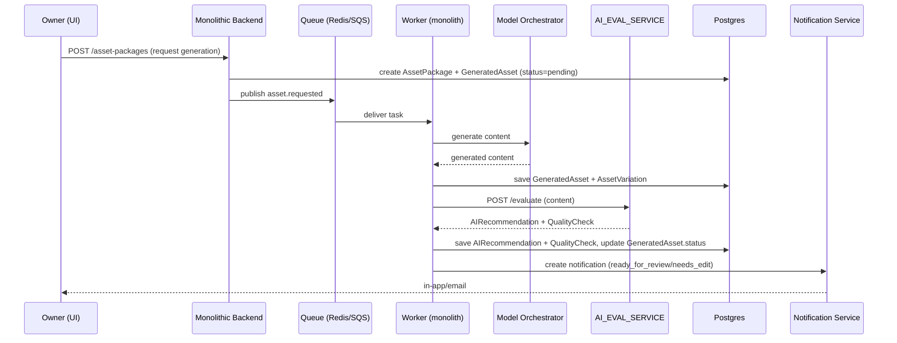
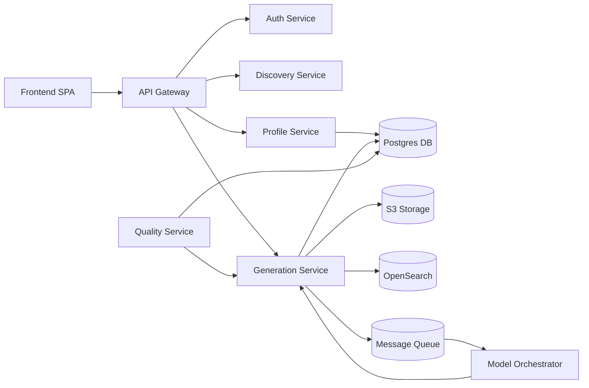
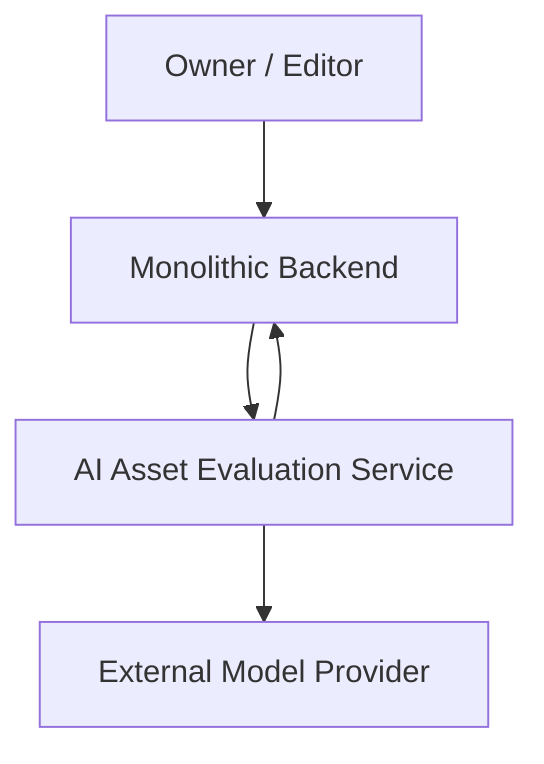
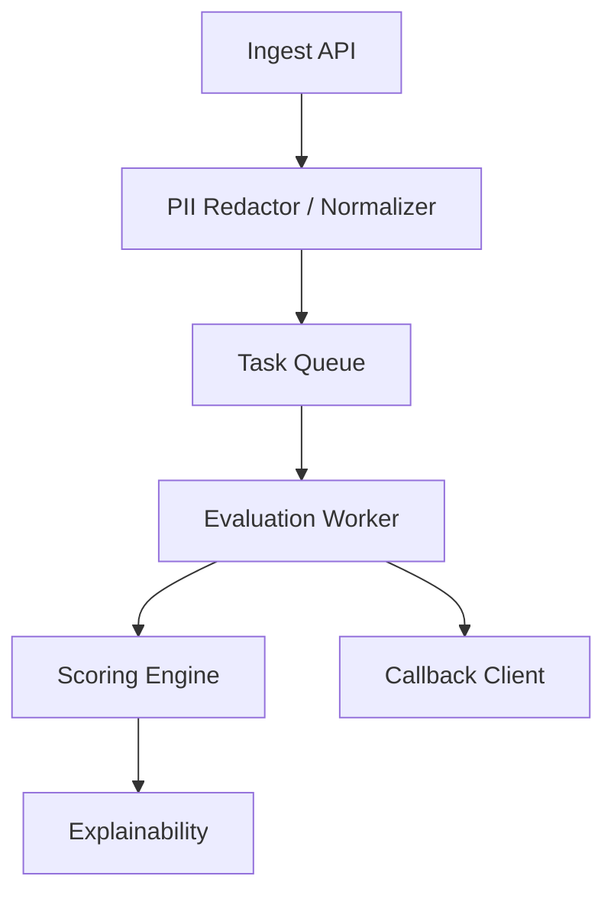

% AI Business Presence Builder - Documento de requisitos del producto (PRD)

> **Nota:** Este documento corresponde a una definición inicial del producto (Entrega 1). Algunas decisiones de diseño, arquitectura y stack tecnológico fueron posteriormente evolucionadas durante la implementación (Entregas 2 y 3). Para el estado implementado final, debe consultarse el contrato de implementación correspondiente ([`docs/ENTREGA2-IMPLEMENTATION-CONTRACT.md`](ENTREGA2-IMPLEMENTATION-CONTRACT.md), [`docs/FASE3-IMPLEMENTATION-CONTRACT.md`](FASE3-IMPLEMENTATION-CONTRACT.md)) y el [README.md](../README.md) actual.

# 1. Resumen Ejecutivo

Descripción general del producto

- AI Business Presence Builder es una plataforma SaaS que ayuda a pequeñas y microempresas a crear y mantener una presencia digital profesional mediante un proceso guiado de descubrimiento y generación de activos asistida por IA.

Problema de negocio

- Muchas PYMEs carecen de tiempo, habilidades o recursos para definir una identidad digital coherente y adaptada a su público, lo que reduce su visibilidad y conversión en línea.

Público objetivo

- Propietarios de PYMEs y emprendedores individuales (restaurantes, comercios locales, servicios profesionales) que necesitan una presencia digital rápida y asequible.

Propuesta de valor

- Transformar información estructurada del negocio en activos listos para publicar (texto web, fichas de directorio, biografías sociales, metadatos SEO) con coherencia y mínima intervención humana.

Ventajas competitivas

- Proceso guiado de descubrimiento que evita prompts libres.
- Perfil canónico reutilizable que garantiza consistencia entre canales.
- Motor de control de calidad y reglas de coherencia.

Diferenciadores basados en IA

- Orquestador de modelos con RAG para contexto y explicabilidad.
- Motor de variaciones controladas (múltiples alternativas con ajuste de tono).
- Recomendaciones explicables y trazabilidad (metadatos de decisión).

---

# 2. Lean Canvas

## Tabla (resumen) — versión MVP revisada

| Sección           | Contenido                                                                                                                              |
| ----------------- | -------------------------------------------------------------------------------------------------------------------------------------- |
| Problema          | PYMEs y microempresas no tienen recursos ni experiencia para crear presencia digital coherente y optimizada localmente.                |
| Segmentos de clientes | Comercios locales (restaurantes, tiendas), profesionales de servicios y emprendedores individuales.                            |
| UVP               | Genera una presencia digital coherente y publicable a partir de una incorporación guiada, reduciendo tiempo y coste frente a agencias.     |
| Solución          | Incorporación estructurada + perfil canónico + generación de 2 tipos de activos (web + ficha local) + previsualización y exportación.     |
| Canales           | Captación en línea (SEO/SEM), contenido educativo, marketplaces SaaS, campañas locales y referidos.                                      |
| Fuentes de ingresos | Suscripción mensual básica; tarifa única de configuración opcional; complemento de publicación automática (integraciones).          |
| Estructura de costes | IA/ML (tokens, embeddings, base de datos vectorial), alojamiento (RDS, almacenamiento de objetos), indexación (OpenSearch), soporte, cumplimiento GDPR y marketing. |
| Indicadores clave | Tasa de activación (incorporación completada), porcentaje de finalización del perfil, tiempo hasta la publicación, porcentaje de activos publicados, CAC, LTV, retención M3.      |
| Ventaja diferencial | Catálogo de plantillas verticales + taxonomía local validada + perfil canónico que permite regeneración consistente.                |

**Supuestos de negocio (MVP):** el cliente pagará por reducir tiempo y coste de puesta en marcha; las integraciones avanzadas se validan después de ventas iniciales.

## Diagrama Mermaid (Lean Canvas — MVP)

# 3. Funcionalidades Principales

Las siguientes funcionalidades están estrictamente acotadas al alcance MVP y respetan la arquitectura modular-monolítica, las entidades y actores ya definidos en este PRD. No se introducen nuevos servicios ni entidades innecesarias.

1. proceso de incorporación guiado (captura estructurada)

- Objetivo: Obtener la información mínima y verificada para crear un `BusinessProfile` usable.
- Usuarios: Owner, Admin
- Flujo operativo: Owner completa formulario paso a paso → validaciones básicas (formatos/obligatorios) → creación/actualización de `BusinessProfile` con estado `draft`.
- Entidades vinculadas: `BusinessProfile`, `User`, `Tenant`.
- Valor de negocio: Reduce fricción de entrada y genera datos coherentes para las siguientes funcionalidades.
- Rol de la IA: Sugerencias de autocompletado y normalización leve (categoría, campos faltantes) como recomendaciones; cambios aplicados sólo tras confirmación humana (HITL).
- Limitaciones MVP: Sin asistente conversacional ni validaciones externas automáticas.

2. Normalización mínima y perfil canónico

- Objetivo: Normalizar campos clave (nombre, categoría, dirección, horario) y registrar sugerencias en `AIRecommendation`.
- Usuarios: Sistema (backend), Admin
- Flujo operativo: Tras completar la incorporación, el módulo de normalización aplica reglas y correspondencia semántica → marca `BusinessProfile` como `normalized` si supera las comprobaciones.
- Entidades vinculadas: `BusinessProfile`, `AIRecommendation`, `AuditLog`.
- Valor de negocio: Evita discrepancias entre activos generados y mejora la calidad de resultados.
- Rol de la IA: Matching semántico para asignar categorías/etiquetas; la IA sólo propone cambios que el Admin revisa.
- Limitaciones MVP: Correcciones automáticas mínimas; la aprobación humana es obligatoria.

3. Generación asistida de activos (paquete web + ficha local)

- Objetivo: Generar contenido para `website copy` y `directory card` a partir del `BusinessProfile`.
- Usuarios: Owner, Admin
- Flujo operativo: Owner solicita paquete → backend crea `AssetPackage` y `GeneratedAsset` en estado `pending` → worker procesa generación asíncrona → `GeneratedAsset` disponible con 1–3 variaciones para revisión.
- Entidades vinculadas: `AssetPackage`, `GeneratedAsset`, `AIRecommendation`, `QualityCheck`.
- Valor de negocio: Proveer contenido listo para revisión que reduce el tiempo de puesta en marcha.
- Rol de la IA: Model Orchestrator usa RAG y plantillas para crear variaciones; siempre debe haber revisión y aprobación humana antes de publicar (HITL).
- Limitaciones del MVP: no se genera contenido visual (imágenes) en esta fase.

4. Control de calidad básico (comprobaciones posteriores a la generación)

- Objetivo: Detectar inconsistencias y validar requisitos mínimos de calidad antes de revisión humana.
- Usuarios: Sistema, Owner
- El flujo de trabajo: después de generar, se crea un `QualityCheck` con resultados de reglas (por ejemplo, campos obligatorios y longitud mínima) y una puntuación sencilla → si falla, `GeneratedAsset` se marca como `needs_edit` y se notifica al Owner.
- Entidades vinculadas: `GeneratedAsset`, `QualityCheck`.
- Valor de negocio: Reduce revisiones manuales redundantes y mejora tasa de aceptación.
- Rol de la IA: modelos ligeros para clasificar inconsistencias y calcular una puntuación; las correcciones siguen siendo manuales.
- Limitaciones MVP: Comprobaciones limitadas a reglas y clasificadores simples; no hay corrección automática de textos.

5. Edición y previsualización

- Objetivo: Permitir la edición manual de `GeneratedAsset` y previsualizar formatos objetivo (web/ficha local).
- Usuarios: Owner
- Flujo operativo: Owner selecciona variación → edita en editor básico → guarda versión (crea/actualiza `AssetVariation`) → previsualiza.
- Entidades vinculadas: `GeneratedAsset`, `AssetVariation`, `AuditLog`.
- Valor de negocio: Facilita la aprobación y reduce fricción antes de publicación.
- Rol de la IA: Sugerencias de micro-edición (frases alternativas) presentadas como opciones; aplicación humana requerida.
- Limitaciones MVP: Editor con funcionalidades esenciales; no integra contenido multimedia enriquecido ni CMS complejo.

6. Publicación manual y exportación

- Objetivo: Facilitar la exportación manual o publicación asistida a canales soportados mínimamente (ej. exportar CSV, copiar contenido a CMS vía API simple).
- Usuarios: Owner, Admin
- Flujo operativo: Owner solicita `Publicar` → se crea `PublicationTask` en cola → worker ejecuta la acción hacia la integración configurada → estado registrado en `PublicationTask`.
- Entidades vinculadas: `GeneratedAsset`, `PublicationTask`, `Attachment`.
- Valor de negocio: Cierra el flujo de creación a publicación sin automatismos riesgosos.
- Rol de la IA: Validación final de campos SEO y sugerencias de meta; no hay publicación autónoma.
- Limitaciones del MVP: las integraciones son limitadas y requieren autorización manual; no existe una orquestación compleja.

7. Historial de versiones y regeneración controlada

- Objetivo: Conservar versiones y permitir regenerar nuevas variaciones sin sobrescribir contenido aprobado.
- Usuarios: Owner, Admin
- Flujo operativo: Cada edición crea una nueva `AssetVariation`; opción `Regenerar` genera nuevas variaciones vinculadas y no borra la versión aprobada.
- Entidades vinculadas: `GeneratedAsset`, `AssetVariation`, `AuditLog`.
- Valor de negocio: Soporta iteración segura y recuperación de versiones.
- Rol de la IA: Generación de variaciones bajo petición humana; no hay ajustes automáticos.
- Limitaciones MVP: Comparación y fusión manual por el usuario.

8. panel de activación (KPIs básicos)

- Objetivo: Mostrar métricas esenciales: tasa de activación (incorporación completado), % perfiles con activos, assets publicados.
- Usuarios: Owner, Admin
- Flujo operativo: Sistema agrega métricas básicas y las expone en un panel simple; filtros por periodo.
- Entidades vinculadas: `BusinessProfile`, `GeneratedAsset`, `PublicationTask`.
- Valor de negocio: Permite medir adopción y priorizar mejoras tácticas.
- Rol de la IA: Ninguno; métricas agregadas y visualizadas para interpretación humana.
- Limitaciones del MVP: panel básico sin alertas ni análisis predictivo.

Notas generales:

- Todas las funcionalidades mantienen un patrón "IA como asistente" (proponer pero no decidir). HITL es obligatorio para cambios en `BusinessProfile` y publicaciones.
- El backend inicial se implementa como una arquitectura monolítica modular (módulos: discovery, perfil, generación, quality, publication) para acelerar el MVP.
- Funcionalidades enterprise o automatizaciones autónomas quedan fuera del MVP y se priorizan tras validación de mercado.
- La calidad y la coherencia: asegurar que la información se mantenga consistente en los distintos canales.
- Usuarios: Owner, Admin
- Flujo: Recoge telemetría → presenta información relevante → sugiere acciones
- Valor: Dirige mejoras de prioridad alta
- IA: Información accionable y priorización automatizada

---

# 4. Casos de Uso Principales

- - Los casos de uso siguientes derivan directamente de las funcionalidades aprobadas (sección 3). No se introducen nuevos actores, entidades ni servicios. Se detallan validaciones, errores relevantes, procesamiento asíncrono, eventos, notificaciones, HITL, permisos RBAC y requisitos GDPR.

## Caso de uso 1 — Generación asistida de activos (paquete web + ficha local)

- Objetivo: Generar un paquete mínimo de activos (`website copy` + `directory card`) a partir de un `BusinessProfile` normalizado.
- Actores: Owner, Sistema
- Precondiciones:
  - `BusinessProfile` existe y tiene estado `normalized`.
  - Owner autenticado y con permiso `create_asset` (RBAC).
  - Consentimiento GDPR para procesar datos personales del perfil.
- Flujo principal (realista y asíncrono):
  1. Owner solicita generación del paquete desde UI. Evento `asset.requested` emitido.
  2. API valida permisos y estado del `BusinessProfile`; crea `AssetPackage` y `GeneratedAsset` con estado `pending`.
  3. Worker encola la tarea y Model Orchestrator procesa la petición (de forma asíncrona). Durante el proceso se pueden emitir `asset.generation.started` y `asset.generation.progress`.
  4. Model Orchestrator produce 1–3 variaciones y registra `AIRecommendation` con `model_version`, `score` y `explanation`.
  5. servicio de evaluación de calidad ejecuta comprobaciones básicas y crea `QualityCheck` con resultado (pass/warn/fail).
  6. Si `QualityCheck` = `fail` (crítico), `GeneratedAsset` pasa a `needs_edit` y Owner recibe notificación (`notification.correo electrónico`/in-app). Si `pass` o `warn`, `GeneratedAsset` queda `ready_for_review`.
  7. Owner revisa las variaciones, selecciona una y la marca `approved` (HITL). Se registra `AuditLog`.
  8. Owner puede optar por publicar/exportar (sigue Caso de Uso 3).
- Validaciones y errores relevantes:
- Error: el perfil no está normalizado → la API responde con 400 `profile_not_normalized` y sugiere completar los campos.
- Error: falta el consentimiento → 403 `gdpr_consent_required`.
- Error: se ha excedido la cuota o el plan → 402 `quota_exceeded`.
- Error de IA o timeout → el worker marca `GeneratedAsset` como `error`, aplica reintentos limitados y notifica al Owner.
- Eventos y notificaciones:
  - `asset.requested`, `asset.generation.started`, `asset.generation.completed`, `asset.generation.failed`, `asset.ready_for_review`.
  - Notificaciones in-app / correo electrónico para `ready_for_review`, `needs_edit`, `error`.
- Distinción IA vs humano:
  - IA: genera variaciones y sugiere `AIRecommendation` y `QualityCheck` inicial.
  - Humano: valida/acepta sugerencias, selecciona variación y aprueba publicación (HITL obligatorio).

## Caso de Uso 2 — Revisión colaborativa y edición controlada

- Objetivo: permitir la revisión por terceros del `GeneratedAsset`, gestionar comentarios y mantener un versionado seguro.
- Actores: Owner, Colaborador, Sistema
- Precondiciones:
  - `GeneratedAsset` en estado `ready_for_review` o `needs_edit`.
  - Owner o Admin asigna permisos de revisión (rol `reviewer`).
- Flujo principal:
  1. Owner comparte enlace de revisión (permiso `share_review`); el sistema crea un token de acceso temporal y emite `asset.review.shared`.
  2. Colaborador accede con token y añade comentarios o sugerencias; cada comentario se registra y notifica al Owner (`notification.in_app`).
  3. Owner revisa comentarios y puede: aceptar sugerencias manualmente, editar en el editor (creando nueva `AssetVariation`), o solicitar cambios (cambia estado a `in_review`).
  4. Al guardar una edición, se crea una nueva `AssetVariation` y se registra `AuditLog` con actor y timestamp.
  5. Si Owner decide aprobar, marca la `AssetVariation` como `approved` y emite `asset.approved`.
- Validaciones y errores relevantes:
  - Error: token de revisión inválido/expirado → respuesta 401 y registro de intento de acceso en `AuditLog`.
  - Error: permiso insuficiente para editar → 403 `insufficient_permissions`.
  - Conflicto de edición concurrente → sistema muestra advertencia y obliga a guardar como nueva versión.
- Eventos y notificaciones:
  - `asset.review.shared`, `asset.comment.added`, `asset.version.created`, `asset.approved`.
  - Notificaciones a Owner y colaboradores según sus preferencias.
- Distinción IA vs humano:
  - IA: puede sugerir micro-ediciones (opciones de frases) visibles en UI; no edita automáticamente.
  - Humano: decide aplicar sugerencias, resolver comentarios y aprobar versiones.
- GDPR / RBAC:
  - Tokens de revisión expiran y contienen alcance limitado. Comentarios con datos personales se tratan según consentimiento del Tenant.

## Caso de Uso 3 — Publicación manual asistida y registro de auditoría

- Objetivo: publicar manualmente un `GeneratedAsset` aprobado en un canal compatible o exportarlo, garantizando el control humano y la trazabilidad.
- Actores: Owner, Sistema
- Precondiciones:
  - `GeneratedAsset`/`AssetVariation` marcado `approved` por Owner.
  - Owner tiene permiso `publicar_asset`.
- La integración objetivo está configurada y autorizada (credenciales almacenadas con consentimiento GDPR).
- Flujo principal (asíncrono):
  1. Owner inicia publicación desde UI; API crea `PublicationTask` con estado `queued` y emite `publication.requested`.
  2. Worker toma `PublicationTask`, valida credenciales y formato del asset; emite `publication.started`.
  3. Worker llama la API externa o realiza la operación de export (p. ej. POST a CMS) y registra la respuesta.
  4. Si la publicación es exitosa, `PublicationTask` pasa a `completed`, se registra `AuditLog` y Owner recibe notificación `publication.success`.
  5. Si falla (errores 4xx/5xx o timeout), se aplica política de reintentos limitada; si persiste, `PublicationTask` queda `failed` y Owner recibe `publication.failed` con motivo y sugerencias.
- Validaciones y errores relevantes:
  - Error: permiso insuficiente → 403 `insufficient_permissions`.
  - Error: credenciales inválidas → 401 `integration_auth_failed` y `PublicationTask` `failed`.
- Error: incumplimiento de GDPR (sin consentimiento para publicar determinados datos) → 403 `gdpr_restriction`.
  - Error: formato inválido → 400 `invalid_format` con detalles para corrección.
- Eventos y notificaciones:
  - `publication.requested`, `publication.started`, `publication.completed`, `publication.failed`.
  - Notificaciones in-app/correo electrónico con resumen y enlace al `AuditLog`.
- Distinción IA vs humano:
  - IA: solo valida metadatos y sugiere meta tags SEO; no realiza la publicación sin acción explícita del Owner.
  - Humano: autoriza y confirma la publicación.

## Diagrama de Casos de Uso (Mermaid)

```mermaid
usecaseDiagram
actor Owner
actor Colaborador
actor Sistema

Owner --> (Generar bundle de activos)
Owner --> (Revisión colaborativa)
Colaborador --> (Revisión colaborativa)
Owner --> (Publicación manual asistida)
Sistema --> (Generar bundle de activos)
Sistema --> (Publicación manual asistida)
```

---

# 5. Modelo de Datos

- El modelo siguiente está acotado al MVP y utiliza `organization_id` como campo multi-tenant. Incluye únicamente los atributos necesarios para los flujos de trabajo reales descritos (incorporación, generación, revisión y publicación). Las entidades y relaciones son directamente implementables en PostgreSQL mediante claves foráneas, `NOT NULL` cuando corresponde y enums para `status`/`role`.

Principios aplicados:
- `organization_id` en las entidades principales (no utilizar `tenant_id`).
- Mantener pocas tablas y evitar una normalización excesiva en el MVP.
- RBAC ligero: enum `User.role` (owner, admin, reviewer) y comprobaciones en la capa de aplicación.
- Auditabilidad: `AuditLog` registra las acciones críticas.
- Flujos de trabajo asíncronos: `GeneratedAsset` y `PublicationTask` contienen estados que permiten gestionar colas y workers.

## Entidades y atributos (resumen implementable)

- Organization
  - id PK (uuid)
  - name (string) NOT NULL
  - plan (string) -- p.ej. "free", "starter"
  - created_at, updated_at (timestamps)

- User
  - id PK (uuid)
  - organization_id FK -> Organization.id NOT NULL
  - correo electrónico (string) NOT NULL UNIQUE
  - name (string)
  - role (enum) NOT NULL -- values: owner, admin, reviewer
  - disabled (bool) DEFAULT false
  - created_at, updated_at

- BusinessProfile
  - id PK (uuid)
  - organization_id FK -> Organization.id NOT NULL
  - business_name (string) NOT NULL
  - category (string)  -- identificador normalizado de categoría
  - address (jsonb) -- {street, city, postcode, country}
  - phone (string)
  - website (string)
  - status (enum) NOT NULL -- draft, normalized, archived
  - gdpr_consent (bool) NOT NULL DEFAULT false
  - created_by (fk User.id)
  - created_at, updated_at

- AssetPackage
  - id PK (uuid)
  - organization_id FK -> Organization.id NOT NULL
  - profile_id FK -> BusinessProfile.id NOT NULL
  - package_type (enum) -- e.g. web_plus_directory
  - status (enum) -- requested, processing, completed, failed
  - requested_by (fk User.id)
  - created_at

- GeneratedAsset
  - id PK (uuid)
  - organization_id FK -> Organization.id NOT NULL
  - profile_id FK -> BusinessProfile.id NOT NULL
  - package_id FK -> AssetPackage.id
  - asset_type (enum) -- website_copy, directory_card
  - title (string)
  - content (text) -- canonical contenido generado
  - status (enum) -- pending, ready_for_review, needs_edit, approved, error
  - generated_at (timestamp)
  - generated_by (fk User.id) NOT NULL -- user that requested the generación (Owner/Admin)

- AssetVariation
  - id PK (uuid)
  - asset_id FK -> GeneratedAsset.id NOT NULL
  - variation_label (string) -- e.g. "v1", "v2"
  - content (text)
  - created_by (fk User.id) -- indicates if user-saved edit
  - created_at

- QualityCheck
  - id PK (uuid)
  - asset_id FK -> GeneratedAsset.id NOT NULL
  - check_type (string) -- e.g. consistency, length, seo
  - result (enum) -- pass, warn, fail
  - score (numeric) -- optional simple puntuación
  - details (jsonb)
  - created_at

- AIRecommendation
  - id PK (uuid)
  - asset_id FK -> GeneratedAsset.id NOT NULL
  - model_version (string)
  - score (numeric)
  - explanation (jsonb)
  - created_at

- PublicationTask
  - id PK (uuid)
  - organization_id FK -> Organization.id NOT NULL
  - asset_id FK -> GeneratedAsset.id NOT NULL
  - target_integration (string) -- e.g. cms, google_business
  - status (enum) -- queued, started, completed, failed
  - scheduled_at (timestamp) -- optional for scheduled publicares
  - attempts (int) DEFAULT 0
  - last_error (text)
  - created_by (fk User.id)
  - created_at, updated_at

- Attachment
  - id PK (uuid)
  - organization_id FK -> Organization.id NOT NULL
  - asset_id FK -> GeneratedAsset.id
  - filename (string)
  - url (string)
  - mime_type (string)
  - size_bytes (int)
  - created_at

- Notification
  - id PK (uuid)
  - organization_id FK -> Organization.id NOT NULL
  - user_id FK -> User.id NULLABLE
  - channel (enum) -- in_app, correo electrónico
  - payload (jsonb)
  - status (enum) -- pending, sent, failed
  - created_at

- AuditLog
  - id PK (uuid)
  - organization_id FK -> Organization.id NOT NULL
  - actor_id FK -> User.id NULLABLE
  - action (string) -- e.g. asset.generate.requested, asset.approved
  - target_type (string) -- e.g. BusinessProfile, GeneratedAsset
  - target_id (uuid)
  - details (jsonb)
  - timestamp

## Relaciones y cardinalidades (resumen)
- Organization 1..* User
- Organization 1..* BusinessProfile
- BusinessProfile 1..* AssetPackage
- AssetPackage 1..* GeneratedAsset
- GeneratedAsset 1..* AssetVariation
- GeneratedAsset 1..* QualityCheck
- GeneratedAsset 0..* AIRecommendation
- GeneratedAsset 0..1 PublicationTask (un publication task por intento de publicación)
- GeneratedAsset 0..* Attachment
- Organization 1..* Notification
- Organization 1..* AuditLog

## Constraints y notas de implementación (Postgres)
- Usar UUIDs para PK y FK consistentemente (pgcrypto or uuid-ossp).
- Enums para `status` y `role` (enums de esquema o tablas de consulta).
- FK con `ON DELETE CASCADE` en `BusinessProfile`→`GeneratedAsset` depende de la política de borrado; preferible `RESTRICT` + proceso de borrado con consentimientos GDPR.
- Índices: `organization_id` en tablas grandes, `profile_id` en `GeneratedAsset`, `asset_id` en `AssetVariation`/`QualityCheck` y `status` para colas/workers.
- `gdpr_consent` en `BusinessProfile` obligatorio para operaciones que exponen datos personales; API debe validar antes de generar o publicar.

## Diagrama ER (Mermaid, simple y válido en GitHub)



---

# 6. Diseño de Alto Nivel

Objetivo: describir una arquitectura práctica para un MVP que sea un monolito modular desplegable en la nube, con dos servicios desacoplados (`AI Asset Evaluation Service` y `Notification Service`). Evitamos microservicios innecesarios y patrones avanzados (Kafka, CQRS, event sourcing). El diseño es implementable por un equipo pequeño y escalable paso a paso.

- Frontend (SPA - React + TypeScript)
  - Responsabilidad: incorporación guiada, editor de activos, previsualización, panel de revisión y acciones del Owner.
  - Comunicación: llamadas REST/GraphQL al API Gateway; recepción de notificaciones in-app por WebSocket o polling.

- Monolito Backend (modular)
- El núcleo modular se organiza en módulos internos (un módulo equivale a un paquete o capa dentro del monolito):
    - Discovery/Profile: valida y persiste `BusinessProfile` (status draft/normalized).
    - Generation: orquesta la creación de `AssetPackage` y `GeneratedAsset`, encola tareas y expone endpoints síncrono para consultar el estado y asíncrono para los resultados.
    - Quality: aplica reglas y ejecuta llamadas al `AI_EVAL_SERVICE` o a modelos simples para `QualityCheck`.
    - Publication: gestiona `PublicationTask`, validación de integraciones y encolado para publicación.
    - Attachments: API para subir y administrar `Attachment` (metadatos en Postgres y blobs en almacenamiento de objetos).
    - SearchIndexer: indexa `BusinessProfile` y `GeneratedAsset` en OpenSearch cuando corresponde.
    - Auth & RBAC: integración OIDC/JWT y comprobación de `User.role` (owner, admin, reviewer).
    - Audit: registra `AuditLog` para acciones críticas.

  - Diseño: todos los módulos comparten la misma base de código y base de datos (monolito modular). Los módulos se comunican mediante llamadas internas y mensajes ligeros (pub/sub en Redis o SQS) para tareas asíncronas.

- Servicio de evaluación de IA (desacoplado)
  - Responsabilidad: evaluar contenido generado (puntuación, coherencia, toxicidad mínima y aspectos básicos de SEO) y devolver `AIRecommendation` y `QualityCheck` detallados.
  - Justificación de desacoplamiento: carga de evaluación y posibilidad de escalar/actualizar sin desplegar el monolito; interfaz HTTP/REST o gRPC sencilla.

- Notification Service (desacoplado)
  - Responsabilidad: enviar correos electrónicos y gestionar colas de notificaciones dentro de la aplicación; expone una API para crear `Notification` y entregar mensajes por distintos canales.
  - Justificación: limita las dependencias externas y permite cambiar de proveedor sin modificar el monolito.

- Persistencia y almacenamiento
  - PostgreSQL: esquema único con `organization_id` para multi-tenant; enums para estados y roles. Se puede utilizar RLS más adelante.
  - Object storage (S3-compatible): almacenar ficheros/attachments; `Attachment.url` en Postgres.
  - OpenSearch: índice para realizar búsquedas sobre perfiles y assets.
  - Redis o SQS: colas simples para workers (generación, publication, reintentos).

- Observabilidad
  - Métricas (Prometheus), paneles (Grafana), trazas (Jaeger) y logs (ELK/proveedor cloud). Instrumentar endpoints críticos y workers.

- Seguridad
  - Autenticación: OIDC / JWT, tokens cortos y refresh tokens.
  - Autorización: comprobación de `User.role` (RBAC) en la capa API.
  - GDPR: `gdpr_consent` obligatorio en `BusinessProfile` antes de generar/publicar; endpoints para exportar/borrar datos y registro en `AuditLog`.

Patrones de comunicación
- Sincronía: operaciones CRUD (incorporación, editar perfil, editar variación) mediante HTTP síncrono.
- Asincronía: la generación de IA y la publicación → la API crea recursos y encola tareas en Redis/SQS. Los workers procesan y actualizan los estados en Postgres.
- Mensajería ligera: eventos internos emitidos en Redis pub/sub o SQS (nombres: `asset.requested`, `asset.generated`, `asset.ready_for_review`, `publication.requested`, `publication.completed`).
- Integración con `AI_EVAL_SERVICE` y `Notification Service` mediante HTTP REST, con timeouts y reintentos limitados.

Flujos clave

1) Flujo completo de screening asíncrono (generación y evaluación)
- 1. Owner (frontend) solicita generación → POST `/asset-packages` → monolito: crea `AssetPackage` + `GeneratedAsset` (status=pending) y emite `asset.requested`.
- 2. Worker (dentro del monolito) consume la cola, llama al Model Orchestrator (local) para obtener texto generado y guarda `GeneratedAsset` y `AssetVariation` preliminar.
- 3. Worker llama a `AI_EVAL_SERVICE` (HTTP) con el contenido → recibe `AIRecommendation` y `QualityCheck` → persistir en Postgres.
- 4. Si `QualityCheck.result` = `fail` → `GeneratedAsset.status = needs_edit`, crear `Notification` y emitir `asset.needs_edit`.
- 5. Si `pass|warn` → `GeneratedAsset.status = ready_for_review`, `Notification` `asset.ready_for_review`.
- 6. Owner revisa y aprueba (HITL) → `GeneratedAsset.status = approved` → opcional: encola `PublicationTask`.

2) Interacción Frontend - Backend - IA
- El frontend envía una solicitud → la API valida permisos y datos → escribe en la base de datos y responde 202 (cuando aplica) con la ubicación del recurso.
- Backend workers hacen solicitudes a modelos (internos/externo) y a `AI_EVAL_SERVICE`; los resultados se escriben en DB y se notifican al Frontend mediante notificaciones in-app / WebSocket.

3) Manejo de attachments
- flujo de carga: el Frontend solicita una URL presigned al monolito → el cliente sube a S3 → el monolito recibe la confirmación y crea `Attachment` (metadatos) en Postgres.
- `Attachment` se asocia a `GeneratedAsset` y se indexa si es texto; para binarios solo se almacenan los metadatos y la URL.

4) Flujo de indexación y búsqueda
- Cuando `GeneratedAsset` está en `ready_for_review` o `approved`, el SearchIndexer crea o actualiza documentos en OpenSearch (campos de perfil + asset).
- Las búsquedas rápidas de la UI utilizan OpenSearch; las acciones CRUD mantienen una consistencia eventual del índice.

5) Integración calendario / publicación programada
- `PublicationTask.scheduled_at` permite encolar tareas programadas. El scheduler de workers recoge las tareas `queued` con `scheduled_at <= now` y las procesa.

Diagramas (Mermaid)

Arquitectura general (monolito modular + servicios desacoplados):



Flujo de screening (generación asincrónica y evaluación):



Notas operativas y límites del monolito
- Evitar particionar en microservicios: mantener un despliegue único (monolito) para acelerar la iteración.
- Desacoplar únicamente `AI_EVAL_SERVICE` y `Notification Service` para permitir escalar e iterar sin tocar el monolito.
- Los workers y schedulers pueden ejecutarse como procesos separados del mismo despliegue (task runners) o como tareas en Fargate/ECS.

Si quieres, puedo (a) generar un diagrama adicional centrado en publicación programada, o (b) convertir estas responsabilidades en un README de arquitectura con comandos de despliegue sugeridos; ¿qué prefieres?

## Diagrama de arquitectura (Mermaid)



---

## 7. Modelo C4 — AI Asset Evaluation Service (adaptado)

Esta sección contiene tres vistas C4 separadas y progresivas (Context → Container → Component) centradas exclusivamente en el `AI Asset Evaluation Service`. Cada vista aumenta el nivel de detalle sin mezclar infraestructura, dominio ni despliegue.

Objetivo del servicio: recibir contenido generado (texto) desde el monolito, evaluar calidad/consistencia/SEO y devolver `AIRecommendation` y `QualityCheck` al monolito usando patrón callback (HTTP) o webhooks. El servicio minimiza PII y opera de forma asíncrona.

## 7.1 Contexto del sistema (nivel alto)

Descripción: muestra los actores y el servicio en su contexto lógico. No incluye infra de despliegue.



Notas:
- Interacción principal: Monolith envía petición de evaluación (asset_id + metadatos minimizados) y AIEval responde vía callback HTTP a `/api/eval/callback` en el monolito.
- Seguridad: comunicación TLS y token de cliente (per-organización) autenticado.

## 7.2 Diagrama de contenedores (interfaces y límites)

Descripción: muestra contenedores (APIs/servicios) y límites de responsabilidad; evita mostrar infra cloud.

```mermaid
graph LR
  Monolith[Monolithic Backend]
  AIEval[AI Asset Evaluation Service]
  Model[External Model Provider]

  Monolith -->|POST /evaluate (asset_id, redacted_text)| AIEval
  AIEval -->|async call| Model
  AIEval -->|POST callback /api/eval/callback| Monolith

  click Monolith "#" "Monolitio: profile, assets, DB, RBAC, AuditLog"
```

Notas:
- AIEval es un contenedor independiente con su propia responsabilidad: evaluación y explicabilidad. No escribe en la base de datos del monolito; devuelve resultados por callback para que el monolito persista `AIRecommendation` y `QualityCheck`.
- Modelo externo (proveedor) es tratado como dependencia mínima y opcionalmente cachéada por AIEval.

## 7.3 Diagrama de componentes (elementos internos de AIEval)

Descripción: componentes internos del `AI Asset Evaluation Service` y su flujo de inferencia asíncrono. Mantenerlo pequeño y claro.



Flujo interno (resumido):
- Ingest API recibe petición de evaluación (preferiblemente `asset_id` + texto redacted o embedding).
- PII Redactor elimina o tokeniza datos sensibles; guarda minimal context if needed.
- Tarea encolada en Queue; Worker toma la tarea y llama al External Model Provider para inferencia.
- Scorer aplica reglas y transforma respuestas en `AIRecommendation` y `QualityCheck`.
- Explain genera breve explicación (JSON) sobre la decisión.
- Callback Client POSTea resultados al endpoint seguro del monolito (`/api/eval/callback`) y registra estado de entrega internamente.

Seguridad y privacidad:
- Envío mínimo de datos: preferir enviar `asset_id` y un texto redacted o embedding; nunca enviar campos personales sin consentimiento.
- Autenticación mutua opcional (mTLS) o token por organización.
- TTL corto para resultados guardados en memoria; el monolito es responsable de la persistencia permanente.

Integración con UC-01 y flujo de trabajo asíncrono:
- El monolito encola `asset.requested` y devuelve 202 al cliente; AIEval procesa y POSTea callback con `AIRecommendation` + `QualityCheck`; monolito actualiza `GeneratedAsset` y notifica al Owner (in-app/correo electrónico).

Si quieres, aplico un ajuste final para convertir estos diagramas a SVG o generar el DDL asociado al `AIRecommendation` y `QualityCheck`.

---

## 8. Stack tecnológico

Objetivo: proponer un conjunto tecnológico moderno, práctico y operativo para un equipo pequeño. Prioriza la productividad, la simplicidad operativa y unos costes razonables. Cada elección se justifica y se alinea con el monolito modular, la cola asíncrona, OpenSearch, S3 y PostgreSQL.

- Frontend: React + TypeScript + Vite
  - Por qué: productividad, ecosistema maduro, componentes reutilizables y despliegue estático económico (CDN). `Vite` reduce el tiempo de arranque y facilita HMR.
  - Ventajas y compromisos: ecosistema amplio y curva de aprendizaje reducida para nuevos desarrolladores.

- Backend (API + workers): Python + FastAPI
  - Por qué: combinación ligera y productiva para APIs asíncronas, buena compatibilidad con librerías ML, fácil integración con pydantic/SQLAlchemy y despliegues en contenedores (ECS Fargate). Permite exponer endpoints síncrono y consumir tareas asíncrono desde workers.
  - Módulos: discovery/perfil, generación, quality, publication, attachments, searchIndexer, auth, audit (todos dentro del monolito modular).
  - Ventajas y compromisos: menos opinable que NestJS, pero mejor para integración ML; el equipo necesita experiencia en Python.

- ORM / Migraciones: SQLAlchemy + Alembic
  - Por qué: solución robusta para Postgres, ampliamente utilizada y compatible con FastAPI.

- Base de datos: PostgreSQL (RDS / Aurora gestionados)
  - Por qué: ACID, extensible, UUIDs, jsonb para campos flexibles (address, details), y soporte para row-level security si se requiere.
  - Tradeoffs: coste razonable y portabilidad.

- Cola de tareas / Workers: Redis + Dramatiq (o RQ como alternativa simple)
  - Por qué: Redis es sencillo de operar y Dramatiq ofrece un modelo de workers simple y fiable; admite reintentos y backoff. Es adecuado para la generación asíncrona, la publicación y los schedulers.
  - Ventajas y compromisos: Redis es operativo y económico; si se prefiere un proveedor cloud nativo, puede cambiarse a SQS en una fase posterior.

- Almacenamiento de objetos: S3-compatible (AWS S3)
  - Por qué: almacenamiento duradero para attachments, presigned URLs para uploads e integración nativa con la infraestructura cloud.

- Búsqueda / Indexación: OpenSearch
  - Por qué: búsqueda de texto completo + facetas + k-NN (para RAG/embeddings si se habilita) y evita un bloqueo de proveedor fuerte.

- Proveedor y orquestador del modelo
  - MVP: OpenAI / Azure OpenAI mediante un adaptador en el monolito (Model Orchestrator) que encapsula prompts, reintentos, rate-limit y caché.
  - Justificación: acelera el MVP; se mantiene un adaptador para permitir cambiar a una solución alojamiento propio en el futuro.

- Servicio de evaluación de IA (desacoplado)
  - Implementación: servicio separado (Go/Python) con una API clara; AIEval puede utilizar el mismo proveedor de modelo u otros pipelines alternativos. Se comunica mediante HTTP y callbacks.

- Servicio de notificaciones (desacoplado)
  - MVP: SendGrid (correo electrónico) y notificaciones dentro de la aplicación mediante WebSocket; el servicio separado recibe solicitudes y las entrega por distintos canales.

- Autenticación y autorización
  - MVP: Auth0 (gestión OIDC) para acelerar; opción de migrar a Keycloak si se desea una solución alojamiento propio.
  - RBAC: `User.role` (owner, admin, reviewer) comprobado en la autorización de endpoints.

- CI/CD e infraestructura
  - GitHub Actions para pipelines (compilación, pruebas, lint, imagen de contenedor).
  - Contenerización: Docker images.
  - Despliegue: AWS ECS Fargate (serverless contenedores) para API + workers + AIEval (si se desea). Evitar Kubernetes en el MVP.

- Secretos y configuración
  - AWS Secrets Manager / Parameter Store o GitHub Secrets para las credenciales; evitar variables de entorno hardcodeadas.

- Observabilidad
  - puntuaciones: Prometheus + Grafana (alojado o gestionado).
  - Tracing: Jaeger (instrumentación OpenTelemetry en FastAPI).
  - Logs: JSON estructurado enviado al proveedor (CloudWatch/Loki); se prefiere Loki por su coste eficiente.

- Desarrollo y pruebas locales
  - Docker compose para Postgres, Redis y OpenSearch locales; pytest para pruebas; hooks pre-commit (black, isort, ruff).

Decisiones y compromisos resumidos
- Simplicidad operativa: elegir FastAPI + Postgres + Redis + S3 + OpenSearch reduce los componentes y la curva operativa.
- Productividad: React + TS + Vite y FastAPI + pydantic aceleran el desarrollo.
- Coste: comenzar con servicios gestionados (RDS, S3) y pasar a soluciones alojamiento propio si el proyecto escala.
- Evolución: los patrones adaptador (Model Orchestrator, Notification adaptador) permiten sustituir proveedores sin grandes cambios.

Tecnologías evitadas intencionalmente
- No utilizar Kubernetes complejo, service mesh, Kafka ni CQRS/event sourcing en el MVP.

¿Deseas que genere un `stack.md` con comandos Docker/ECS Fargate mínimos y un `docker-compose.yml` para desarrollo local?

---

# 9. Requisitos No Funcionales

Los siguientes NFRs son medibles, verificables y realistas para un MVP SaaS implementado sobre ECS Fargate, PostgreSQL, SQS/Redis, OpenSearch y S3. Cada ítem indica objetivo, métrica/umbral, impacto arquitectónico y mecanismos de cumplimiento.

1) Escalabilidad
- Objetivo: soportar crecimiento inicial sin rediseño.
- Métrica / Umbral: procesar concurrentemente 20 tareas de generación IA activas y mantener cola con profundidad 1.000 sin pérdida; escalar a 100 tareas concurrentes mediante workers en Fargate.
- Impacto arquitectónico: diseño de workers desacoplados, colas (Redis/SQS) y autoescalado de tareas en Fargate.
- Mecanismos: colas con visibility timeout, autoscaling para servicios en Fargate, índices en OpenSearch shard-aware, pruebas de carga periódicas.

2) Disponibilidad
- Objetivo: servicio utilizable por clientes sin interrupciones frecuentes.
- Métrica / Umbral: 99.5% de disponibilidad mensual para endpoints CRUD y 99.0% para pipelines asíncrono (generación/publicación) en el MVP.
- Impacto arquitectónico: redundancia en contenedores, comprobaciones de estado, reintentos y DLQ para tareas fallidas.
- Mecanismos: comprobaciones de estado en ECS, reintentos exponenciales en workers, Dead-Letter Queue (DLQ) para `PublicationTask` y `GeneratedAsset` errors, alertas en Prometheus.

3) Rendimiento
- Objetivo: experiencia responsive en operaciones interactivas y latencias previsibles en generación IA.
- Métrica / Umbral: p50 < 150 ms y p95 < 300 ms para operaciones CRUD; generación IA: p50 < 30 s, p95 < 120 s (MVP, depende de proveedor de modelos).
- Impacto arquitectónico: separar caminos síncrono/asíncrono, caché en Redis para lecturas frecuentes, indexación asíncrona en OpenSearch.
- Mecanismos: instrumentación de latencias, caché de `BusinessProfile` en Redis, timeouts y circuit-breaker al llamar proveedores externos.

4) Seguridad
- Objetivo: proteger datos de clientes y garantizar acceso controlado.
- Métrica / Umbral: 100% de tráfico TLS; 0 exposiciones de credenciales en repositorios; revisión de vulnerabilidades trimestral.
- Impacto arquitectónico: OIDC/JWT, secrets manager, roles en la app y RLS opcional en Postgres.
- Mecanismos: OIDC (Auth0), validación RBAC por endpoint, almacenamiento de secretos en AWS Secrets Manager, escaneo SCA en CI, WAF mínimo en front door.

5) Observabilidad
- Objetivo: detectar y diagnosticar incidentes rápidamente.
- Métrica / Umbral: alertas configuradas para latencia p95, tasa de errores >1% y profundidad de cola > 500; tiempo medio a detectar (MTTD) < 5 min.
- Impacto arquitectónico: instrumentación con OpenTelemetry, exportación a Prometheus/Grafana y Jaeger para trazas.
- Mecanismos: métricas por endpoint y worker, paneles críticos, alertas en Prometheus Alertmanager, logs estructurados y retención mínima de 30 días.

6) Auditabilidad
- Objetivo: mantener trazabilidad de acciones críticas (HITL approvals, publicaciones, borrados GDPR).
- Métrica / Umbral: 100% de eventos críticos registrados en `AuditLog`; exportación de logs de auditoría en formato JSON disponible bajo petición.
- Impacto arquitectónico: tabla `AuditLog` inmutable, retención definida y controles de acceso a export.
- Mecanismos: insertar AuditLog en transacción con cambios relevantes; firmar y versionar entradas sensibles; mecanismos de export/erase compatibles GDPR.

7) Mantenibilidad
- Objetivo: permitir a un equipo pequeño iterar y liberar con seguridad.
- Métrica / Umbral: cobertura de pruebas automatizadas >= 60% en módulos core; tiempo medio de despliegue (CI→Prod) < 30 min.
- Impacto arquitectónico: monolito modular, repositorios y pipelines claros, pruebas unitarias e integradas.
- Mecanismos: GitHub Actions para CI, pre-commit hooks, revisión obligatoria de PR, entornos staging y canary deploys en Fargate.

8) Resiliencia
- Objetivo: comportamiento robusto ante fallos parciales de dependencias externas.
- Métrica / Umbral: porcentaje de tareas reintentadas con éxito > 85% ante fallos transitorios; DLQ ratio < 5% tras reintentos.
- Impacto arquitectónico: reintentos, backoff, DLQ, circuit-breaker en llamadas externas.
- Mecanismos: implementación de backoff exponencial en workers, DLQ para `PublicationTask`, circuit-breaker configurable para proveedor del modelo y APIs externas.

9) GDPR / Privacidad
- Objetivo: cumplir requisitos de privacidad y permitir derechos del interesado.
- Métrica / Umbral: solicitudes de acceso/borrado respondidas en <= 30 días (MVP); `gdpr_consent` verificado antes de cualquier envío a modelos externos.
- Impacto arquitectónico: flags de consentimiento en `BusinessProfile`, proceso de borrado que respeta relaciones y AuditLog, minimizar PII enviado a AIEval (preferir embeddings/redaction).
- Mecanismos: endpoints `/data/export` y `/data/delete`, proceso de borrado asíncrono con verificación humana para datos ligados a activos públicos, registro de consentimientos en DB.

10) Costes operativos
- Objetivo: mantener costes razonables en fase inicial.
- Métrica / Umbral: coste infra objetivo < €2.500 / mes para primeros 100 clientes (estimación MVP), monitorizado mensualmente.
- Impacto arquitectónico: uso de servicios gestionados (RDS, S3, OpenSearch managed) y escalado automático en Fargate.
- Mecanismos: alertas de coste, revisión mensual, uso de reserved instances/savings plans según uso, ajustar carga de trabajo y tamaños de instancia.

Notas finales:
- Todos los umbrales son iniciales y deben validarse con carga real en la fase de piloto.
- Las verificaciones se realizan mediante pruebas automatizadas, smoke-pruebas, pruebas de carga y revisiones trimestrales de seguridad y costes.
- Cualquier incumplimiento crítico (p. ej. falla GDPR, fuga de credenciales) activa el plan de respuesta a incidentes y notificación a stakeholders.

---


# 10. Roadmap Futuro

Este roadmap es incremental, realista para el MVP y orientado al valor de negocio verificable. Cada ítem indica: valor de negocio, complejidad técnica (baja/media/alta), dependencias de datos/infra y relación con las funcionalidades actuales. HITL y cumplimiento GDPR siguen siendo obligatorios en todos los hitos.

Prioridad Alta (próximos 3–6 meses)

- Integraciones básicas CMS y Google Business Profile
  - Valor: Reduce fricción para publicar activos y acorta el ciclo Owner→Publicación (aumenta assets publicados %).
  - Complejidad: baja
  - Dependencias: `PublicationTask`, almacenamiento de credenciales seguro (Secrets Manager), `AuditLog`, permisos RBAC.
  - Relación con funcionalidades actuales: extiende la funcionalidad 6 (Publicación manual) añadiendo adaptadores concretos; mantiene HITL (Owner autoriza publicación).

- Biblioteca de plantillas y mejoras RAG (calidad de generación)
  - Valor: aumenta la tasa de aceptación de activos (reduce tiempo de edición), mejora coherencia sectorial y conversión inicial.
  - Complejidad: media
  - Dependencias: `Model Orchestrator`, OpenSearch (para embeddings/context), `AssetPackage` y `GeneratedAsset` para A/B seguimiento.
  - Relación con funcionalidades actuales: mejora 3 (Generación asistida) y 4 (QualityCheck) sin cambiar flujos HITL.

- Mejoras UX: editor enriquecido y flujo de revisión colaborativa
  - Valor: reduce fricción en aprobación (menor tiempo hasta la publicación) y mejora retención por facilidad de uso.
  - Complejidad: baja
  - Dependencias: `AssetVariation`, `AuditLog`, notificaciones in-app y tokens de revisión.
  - Relación con funcionalidades actuales: extiende 5 (Edición y previsualización) y 2 (Normalización) con controles de versión claros.

- analítica operacional básico (seguimiento de eventos y panel avanzado)
  - Valor: métricas accionables (activation, tasa de publicación, tasa de aceptación) para priorizar producto y medir LTV/CAC.
  - Complejidad: baja
  - Dependencias: eventos en Postgres/AuditLog, OpenSearch para consultas analíticas, pipelines ETL sencillos.
  - Relación con funcionalidades actuales: complementa 8 (panel de activación) con datos de uso reales.

Prioridad Media (6–12 meses)

- Conectores adicionales y programación de publicación
  - Valor: habilita publicaciones programadas y mayor alcance, incrementa valor percibido por clientes con operaciones (p. ej. restaurantes).
  - Complejidad: media
  - Dependencias: `PublicationTask.scheduled_at`, worker scheduler, integraciones OAuth/almacenamiento de credenciales, DLQ y reintentos.
  - Relación con funcionalidades actuales: extiende 6 (Publicación manual) a publicación programada, siempre con confirmación humana para integraciones sensibles.

- A/B testing de variaciones y métricas de rendimiento simple
  - Valor: permite medir qué variaciones convierten mejor y optimizar plantillas basadas en datos.
  - Complejidad: media
  - Dependencias: seguimiento (etiquetado de eventos), analítica infra, `AssetVariation` y control de versiones.
  - Relación con funcionalidades actuales: reutiliza `AssetVariation` y `GeneratedAsset` para experimentación controlada; decisiones finales permanecen HITL.

- Normalización asistida mejorada (sugerencias más robustas)
  - Valor: reduce trabajo manual del Admin y mejora calidad de perfil para generar activos más relevantes.
  - Complejidad: media
  - Dependencias: AIRecommendation, QualityCheck, OpenSearch taxonomías.
  - Relación con funcionalidades actuales: mejora 2 (Normalización mínima) conservando aprobación humana.

Prioridad Baja (12+ meses, dependerá de adopción y datos)

- Soporte multi-idioma (localización básica)
  - Valor: abre nuevos mercados y mejora conversión local.
  - Complejidad: media
  - Dependencias: Model Orchestrator, plantillas localizadas, pruebas de calidad por idioma.
  - Relación con funcionalidades actuales: amplía 3 (Generación asistida) y 5 (Edición) a múltiples idiomas, mantiene HITL.

- analítica avanzado y recomendaciones accionables
  - Valor: métricas de conversión y recomendaciones que permiten priorizar mejoras del contenido (no decisiones automáticas de negocio).
  - Complejidad: alta
  - Dependencias: pipelines de eventos, almacenamiento histórico, herramientas BI / OpenSearch, y consentimiento GDPR para seguimiento.
  - Relación con funcionalidades actuales: conecta con panel (8) y con AIRecommendation para sugerencias, siempre presentadas como recomendaciones para revisión humana.

- Widget embebible básico y export al canal local (p. ej. fichas locales)
  - Valor: facilita adopción en clientes con sitios simples y reduce fricción de publicación manual.
  - Complejidad: media
  - Dependencias: endpoints públicos protegidos, CORS, PublicationTask, Attachment storage.
  - Relación con funcionalidades actuales: complementa 6 (Publicación) y 5 (Edición) con opciones de entrega ligera.

Guardas de seguridad y criterios de aceptación

- Todos los hitos deben incluir validación de valor mediante métricas (p. ej., porcentaje de activos publicados, tiempo hasta la publicación y tasa de aceptación) antes de escalar.
- Ninguna funcionalidad que implique toma de decisiones automatizada en producción sobre publicación o cambios en `BusinessProfile` se desplegará sin un modo claramente marcado como "solo recomendación" y aprobación HITL.
- Implementación incremental: cada entrega menor (sprint) debe incluir pruebas de integración, checklist GDPR y un plan de retroceso.

Si quieres, aplico esto sobre `AI_BPB-PRD.md` (ya hecho) y genero una versión resumida en formato tabla para roadmap y una checklist de criterios de aceptación para cada ítem. ¿Lo genero ahora?

---

# 11. Conclusiones

La arquitectura propuesta para AI Business Presence Builder es un monolito modular con dos servicios desacoplados (`AI Asset Evaluation Service` y `Notification Service`) desplegado en ECS Fargate. Esta decisión prioriza la velocidad de entrega del MVP y la capacidad de iterar sobre el pipeline de generación y publicación sin necesidad de un ecosistema de microservicios completo.

La coherencia entre negocio, datos y arquitectura se sostiene en tres vectores:

- Datos: el modelo relacional en PostgreSQL usa `organization_id` para multi-tenant y mantiene entidades core (`BusinessProfile`, `GeneratedAsset`, `AssetVariation`, `PublicationTask`, `AIRecommendation`, `QualityCheck`) que soportan los flujos de incorporación, generación, revisión y publicación.
- Negocio: el producto incrementa valor al reducir el tiempo hasta la publicación de activos digitales y alinear la generación IA con flujos de aprobación humana (HITL), de modo que la plataforma actúe como asistente en lugar de agente autónomo.
- Arquitectura: la separación entre la lógica del monolito y los servicios externos (evaluación IA, notificaciones, almacenamiento S3, búsqueda OpenSearch) reduce el acoplamiento y permite escalar los componentes que más carga generan sin reimplementar el core.

El rol de la IA en el sistema es de apoyo y explicabilidad:

- `Model Orchestrator` y el `AI Asset Evaluation Service` generan y evalúan contenido, pero no toman decisiones finales de publicación ni modifican `BusinessProfile` sin intervención humana.
- Las recomendaciones generadas se guardan en `AIRecommendation` y se acompañan de metadatos explicable (`model_version`, `score`, `explanation`).
- El flujo HITL es obligatorio en cambios de perfil y aprobaciones de publicación, lo que limita el alcance de los modelos a sugerencias revisables.

La escalabilidad realista se basa en un escenario de MVP SaaS:

- ECS Fargate permite aumentar contenedores para la API y los workers de forma independiente.
- SQS/Redis desacoplan el procesamiento asíncrono de generación y publicación.
- OpenSearch soporta búsquedas y taxonomías sin requerir reingeniería del dominio.

El cumplimiento GDPR se articula en `BusinessProfile.gdpr_consent`, endpoints de exportación/borrado y trazabilidad mediante `AuditLog`. El diseño evita enviar PII innecesario a servicios externos mediante redacción o embeddings, y cada compilación plano mantiene un rastreo de consentimiento y acciones críticas.

## Anexos prácticos y verificables

### A. Estructura de carpetas sugerida

```
entrega1-MGB/
  README.md
  AI_BPB-PRD.md
  backend/
    app/
    tests/
    alembic/
    Dockerfile
  frontend/
    src/
    public/
    package.json
  docs/
    architecture.md
    api-spec.md
  infra/
    ecs/
    terraform/
    docker-compose.yml
  tests/
    integration/
    unit/
```

### B. Checklist de Solicitud de cambio

- [ ] Descripción del cambio vinculada al alcance del MVP
- [ ] Tests unitarios para nuevas rutas y lógica de negocio
- [ ] pruebas de integración para flujos asíncrono (`AssetPackage` → `GeneratedAsset` → `PublicationTask`)
- [ ] Validación de criterios GDPR en incorporación y publicación
- [ ] análisis estático / formateo aplicados al backend y frontend
- [ ] Documentación actualizada en `README.md` o `docs/`
- [ ] Revisiones completadas por al menos un desarrollador adicional

### C. Supuestos consistentes

- Multi-tenant gestionado con `organization_id` en todas las tablas principales.
- El backend es un monolito modular con workers para el procesamiento asíncrono.
- La IA opera como asistente, no como agente autónomo.
- La publicación exige HITL y controla credenciales en un almacén seguro.
- OpenSearch y S3 son componentes de infraestructura usados para búsqueda y attachments.
- El roadmap incremental se basa en optimizaciones del pipeline de generación y en analítica verificable.

### D. Riesgos técnicos reales

- Dependencia de proveedores de IA: los cambios en la latencia o el coste pueden afectar directamente al SLA de generación `p95`.
- Balance de consistencia: mantener versiones de `GeneratedAsset` y `AssetVariation` puede generar deuda si los flujos de edición no se normalizan con políticas claras.
- Retraso en la publicación: el uso de DLQ y reintentos en `PublicationTask` introduce complejidad operativa que debe monitorearse.
- Cumplimiento GDPR: la eliminación asíncrona de datos vinculados a assets aprobados requiere un proceso de borrado controlado y revisado.
- Acoplamiento de la capa de auth: las dependencias sobre OIDC/JWT y RBAC deben probarse con casos de permisos granulares.

---
